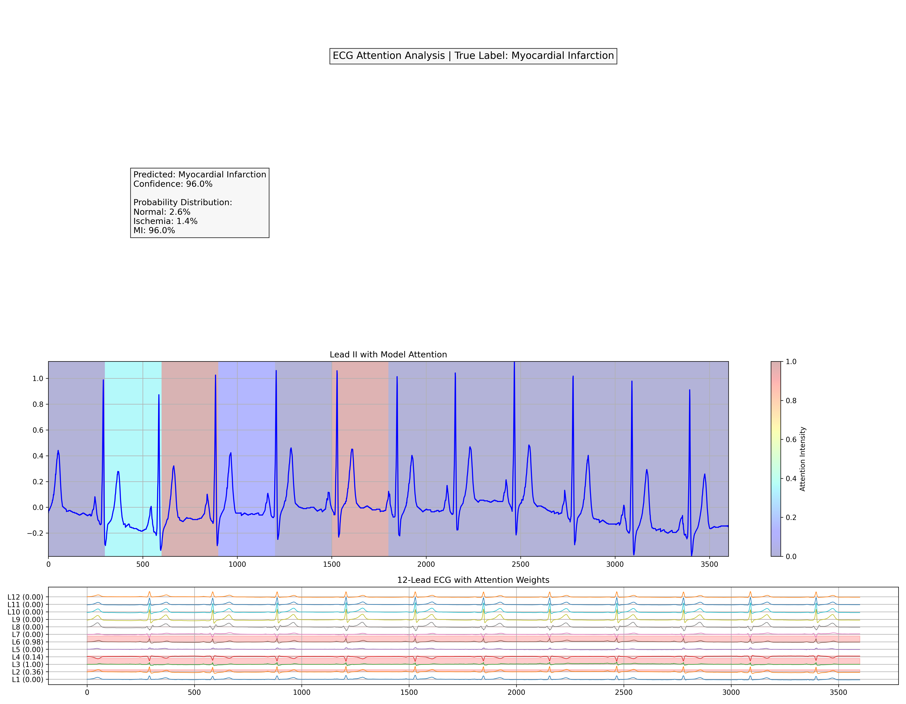

# ECG-Based Heart Attack Detection using Transformers

This project implements a deep learning model to classify 12-lead ECG signals into:
- **Normal**
- **Myocardial Infarction (MI)**
- **Ischemia**

It leverages a **temporal Transformer** encoder that classifies multi-lead ECG signals by encoding their temporal patterns and visualizes important ECG signal regions using **Grad-CAM**, offering both accurate predictions and model explainability.

The main goal of the project is the **early detection** of heart attacks from raw ECG waveforms.

---

## 🛠️ How to Run?

### 1. Install dependencies

```bash
pip install -r requirements.txt
```

### 2. Run the main analysis

```bash
python main.py
```

- Loads a trained model (or trains one if unavailable)
- Performs predictions on test samples
- Generates Grad-CAM heatmaps for ECG signal interpretation

---

##  Sample Output

**ECG Grad-CAM visualization for Myocardial Infarction:**



---

## 📚 Dataset(s) Used

**[PTB-XL ECG Dataset](https://physionet.org/content/ptb-xl/1.0.3/)**  
- 12-lead ECGs, 100Hz and 500Hz  
- Labeled with diagnostic classes including MI and ischemia

(You must download the dataset manually and preprocess before training)

---
